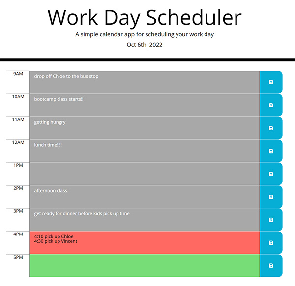
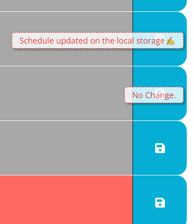

# workday-scheduler

## Description

This webpage is created to make a simple calendar application that allows a user to save schedule for each hour of the day. HTML and CSS are updated with jQuery, and moment.js is used to have current date on the header, and for each time block to have different background colors depending on the current time. The user input will be saved on the local storage.

## Usage
- The URL of the Deployed page:  
https://morisky78.github.io/workday-scheduler/

- The URL of the GitHub repository:  
https://github.com/morisky78/workday-scheduler

- Check today's date on the header
- Each time block has background color to indicate whether it is in the past(gray), present(orange), of future(green)
- Click into a timeblock and enter an event
- Click the save button for the timeblock, then the event is saved in local storage and show the message as shown on the screen shot below.
- The App will be refreshed every top the hour to change the background color accordingly

### Screenshots of the app


### HTML format for each timeblock
Each timeblock has the same HTML code with different data-hour attribute indicating the hour in 24 hour format.
```HTML
<div class="row time-block" data-hour="9">
    <div class="col-1 hour">9AM</div>
    <textarea class="col-10 past"></textarea>
    <button class="col-1 saveBtn d-flex justify-content-center align-items-center"><i class="fas fa-save"></i></button>
    <p class="update-msg"></p>
</div>
```

## Credits
For deeper understanding, I researched related topics and referred to following articles.

- jQuery.each()
https://api.jquery.com/jquery.each/

- parseInt
https://www.w3schools.com/jsref/jsref_parseint.asp